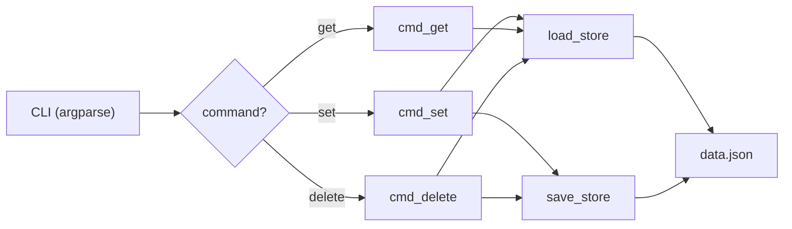
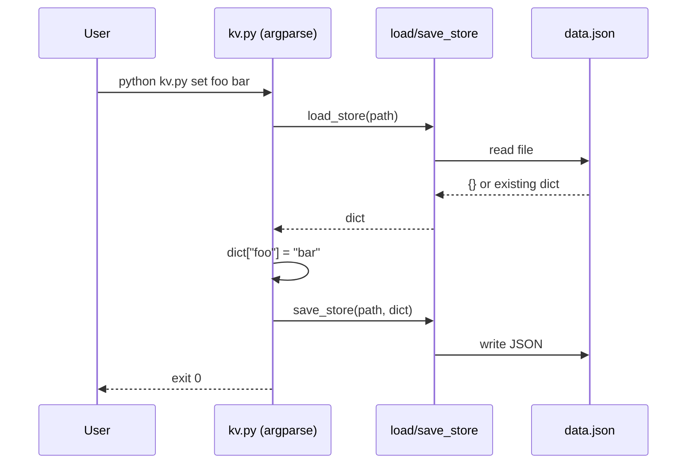

# Design: kvstore

## Architecture Overview
Single-module design. `kv.py` contains all logic: argument parsing, file I/O, and command dispatch. No classes needed — just functions.



## Module Design

### kv.py
- **Purpose**: CLI entry point and all store operations
- **Interface**:
  ```python
  def load_store(path: Path) -> dict[str, str]:
      """Load JSON store from disk. Returns {} if file missing."""

  def save_store(path: Path, store: dict[str, str]) -> None:
      """Write store dict to JSON file."""

  def cmd_set(args: argparse.Namespace) -> int:
      """Set key=value, return 0."""

  def cmd_get(args: argparse.Namespace) -> int:
      """Print value for key, return 0. Return 1 if key not found."""

  def cmd_delete(args: argparse.Namespace) -> int:
      """Delete key if present, return 0."""

  def main(argv: list[str] | None = None) -> int:
      """Parse args and dispatch to command handler."""
  ```
- **Dependencies**: `argparse`, `json`, `pathlib`, `sys`

## Data Flow



## Error Handling Strategy

| Scenario | Behavior |
|----------|----------|
| `data.json` missing | Treat as empty store `{}` |
| `data.json` corrupt | Let `json.JSONDecodeError` propagate (crash with traceback) |
| Key not found on `get` | Print "Key not found: <key>" to stderr, exit 1 |
| Key not found on `delete` | Silent no-op, exit 0 |
| Missing CLI arguments | argparse prints usage and exits 2 |

## Property Tests

Properties that must hold true across the system. Each property validates one or more requirements from spec.md.

### P1: Round-trip persistence
- **Validates**: R1.1, R2.1, R4.1
- **Statement**: For any key k and value v, `set(k, v)` followed by `get(k)` returns v
- **Example**: `set foo bar` then `get foo` → prints "bar", exit 0
- **Test approach**: Set a key, reload store from disk, verify value matches

### P2: Delete removes key
- **Validates**: R3.1, R2.2
- **Statement**: After `delete(k)`, `get(k)` must return exit code 1
- **Example**: `set foo bar`, `delete foo`, `get foo` → exit 1
- **Test approach**: Set, delete, then get — assert exit code 1

### P3: Idempotent delete
- **Validates**: R3.2
- **Statement**: Deleting a non-existent key is a no-op (exit 0, store unchanged)
- **Example**: `delete nonexistent` on empty store → exit 0, `data.json` unchanged
- **Test approach**: Delete missing key, assert exit 0 and store unchanged

### P4: Empty store on missing file
- **Validates**: R4.2
- **Statement**: `load_store()` on a non-existent path returns `{}`
- **Example**: Fresh directory, `get anything` → exit 1
- **Test approach**: Call `load_store` with non-existent path, assert `{}`

### P5: Overwrite semantics
- **Validates**: R1.2
- **Statement**: `set(k, v2)` after `set(k, v1)` replaces v1 with v2
- **Example**: `set foo bar`, `set foo baz`, `get foo` → "baz"
- **Test approach**: Set same key twice with different values, verify latest wins

## Edge Cases
- Empty string as key or value (allowed — strings are strings)
- Very long keys/values (no limit enforced)
- `data.json` with extra whitespace or formatting (json.load handles it)
- Running commands with no prior `data.json` (handled by P4)

## Security Considerations
- Not applicable for this scope (local CLI tool, no network, no auth)
